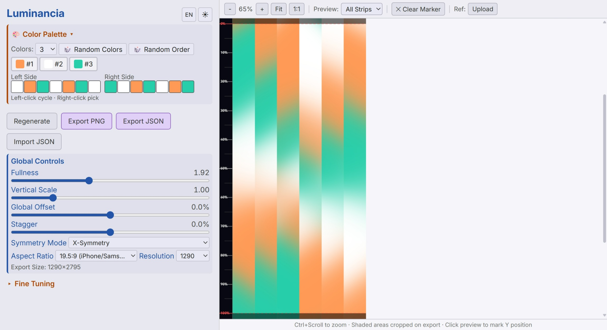

# Luminancia - 彩虹壁纸生成器

基于各向异性高斯混合模型的渐变壁纸生成工具。六条竖直色带拼接，颜色有机交融。

[English](README.md)

<p align="center"></p>

## 快速开始

用现代浏览器打开 `luminancia.html`。无需服务器，无依赖。

## 功能

- 从 35 色色卡中自选 2-12 种颜色
- 4 种宽高比预设 + 自定义导出分辨率
- 4 种对称模式：X 对称、平移、Y 对称、中心对称
- 每条带 7 个色段，每个色段独立控制位置、扩散、角度、离心率
- 日间/夜间模式切换
- 中/英文语言切换
- 导出 PNG 壁纸和 JSON 参数文件

## 项目文件

```
luminancia.html        - 主页面
css/style.css         - 样式 (CSS 变量实现日夜间主题)
js/config.js          - 常量、色板、语言字典
js/params.js          - 参数存储、预设方案、对称逻辑
js/renderer.js        - 高斯混合渲染引擎
js/ui-params.js       - 侧栏控件 (滑条、取色器、色序编辑)
js/ui-preview.js      - 预览区 (缩放、参考图、标记线)
js/main.js            - 初始化与事件绑定
fonts/                - Inter 可变字体
```

## 许可

MIT
